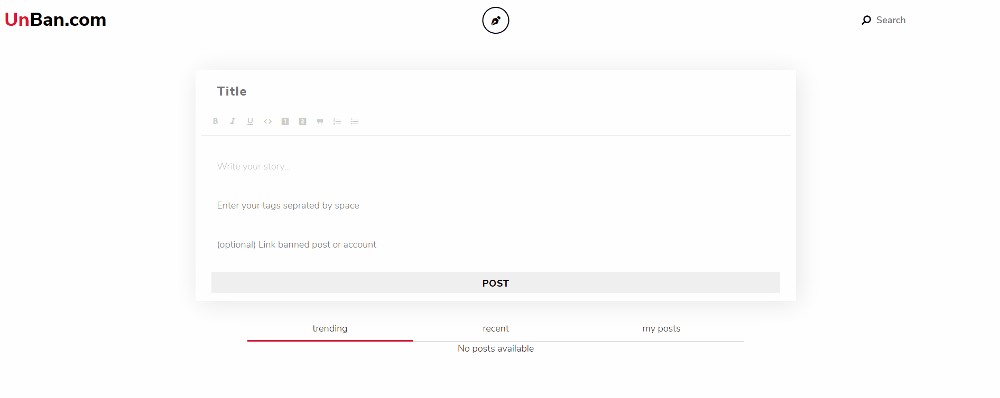

# 🚧 THIS PROJECT IS STILL IN DEVELOPMENT AND DOES NOT REPRESENT A FINAL PRODUCT 🚧

## Work Details

I have been contracted to work as the main front end developer of this project and will be apart of shipping the complete project very soon
How the project was built

- Working alongside a backend developer to design the API used to process data
- Implemented API calls and state management with `react-redux` and `redux-thunk`
- Used CSS animations and the `CSS Transition` library for final touches
- Integrated the `slate js` rich text editor library for users to customize blog post formats
- Added form validation and account authentication
- The project as it stands is compatible with the Hive Blockchain for posting and receiving content and or transactions

# RUN THIS PROJECT

### `git clone`

### `git clone git@github.com:ramos-codes/hive-blockchain-project.git`

### `npm install`

### `npm start`

Runs the app in the development mode. 
Open [http://localhost:3000](http://localhost:3000) to view it in the browser.
The page will reload if you make edits. 
You will also see any lint errors in the console.
